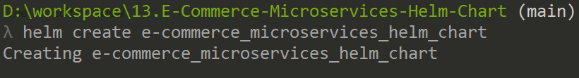
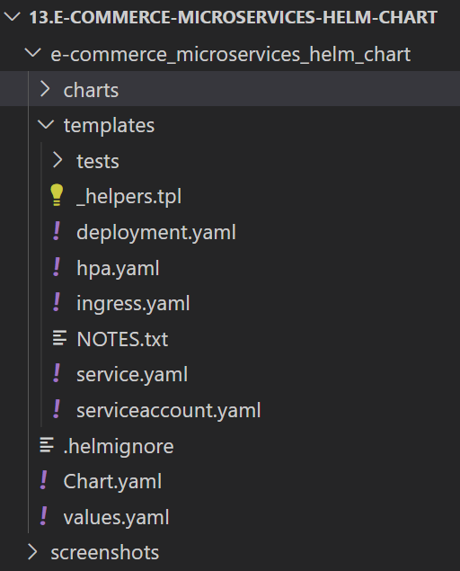
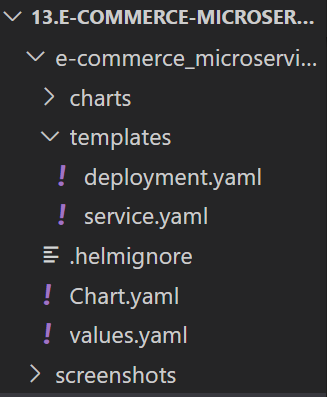

# Microservices based e-Commerce App Deployment using Helm Chart
In this demo application, we are going to deploy a microservices based E-Commerce web application with 11 microservices on Kubernetes using **Custom Helm Chart**.

Online Boutique is a cloud-native microservices demo application. Online Boutique consists of a 11-tier microservices application. The application is a web-based e-commerce app where users can browse items, add them to the cart, and purchase them.

### Options to define Helm chart
There are multiple options to define helm chart for this application. 

1. Create Helm chart for each Microservice (in total approx 10).
2. Create a single Helm chart for all Microservices.

There is a third option available, **Combination of both options**. We can create shared chart for similar applications and separate charts for completely different apps. 

**Note:** In our case, we'll define a single shared Helm Chart for all Microservices.  

## Step 1: Create Custom Helm Chart
First of all we'll be creating a custom helm chart using followng command.

`helm create e-commerce_microservices_helm_chart`

After the execution of command, a default directory structure will be created as following: 
 

We are going to delete mostly default template files to create our own. Delete following files from the **template** directory:
- _helpers.tpl
- hpa.yaml
- ingress.yaml
- NOTES.txr
- serviceaccount.yaml 

Our new directory structure will look like. 

