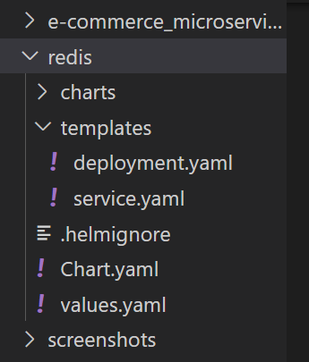

# Microservices based e-Commerce App Deployment using Helm Chart
In this demo application, we are going to deploy a microservices based E-Commerce web application with 11 microservices on Kubernetes using **Custom Helm Chart**.

Online Boutique is a cloud-native microservices demo application. Online Boutique consists of a 11-tier microservices application. The application is a web-based e-commerce app where users can browse items, add them to the cart, and purchase them.

### Options to define Helm chart
There are multiple options to define helm chart for this application. 

1. Create Helm chart for each Microservice (in total approx 10).
2. Create a single Helm chart for all Microservices.

There is a third option available, **Combination of both options**. We can create shared chart for similar applications and separate charts for completely different apps. 

**Note:** In our case, we'll define a single shared Helm Chart for all Microservices.  

## Step 1: Create Custom Helm Chart
First of all we'll be creating a custom helm chart using followng command.

`helm create e-commerce_microservices_helm_chart`


After the execution of command, a default directory structure will be created as following: 
 


We are going to delete mostly default template files to create our own. Delete following files from the **template** directory:
- _helpers.tpl
- hpa.yaml
- ingress.yaml
- NOTES.txr
- serviceaccount.yaml 

Our new directory structure will look like. 


## Step 2: Create Template Files for Deployment and Service
Now we need to create a template files for deployment and service. 

**Deployment template file** contents: 
```
apiVersion: apps/v1
kind: Deployment
metadata:
  name: {{ .Values.appName }}
spec:
  replicas: {{ .Values.appReplicas }}
  selector:
    matchLabels:
      app: {{ .Values.appName }}
  template:
    metadata:
      labels:
        app: {{ .Values.appName }}
    spec:
      containers:
        - name: {{ .Values.appName }}
          image: "{{ .Values.appImage }}:{{ .Values.appVersion }}"
          ports:
            - name: http
              containerPort: {{ .Values.containerPort }}
              protocol: TCP
          env:
          {{- range .Values.containerEnvVars }}
            - name: {{ .name }}
              value: {{ .value | quote }}
          {{- end }}
```

**Service template file** contents: 
```
apiVersion: v1
kind: Service
metadata:
  name: {{ .Values.appName }}
spec:
  type: {{ .Values.serviceType }}
  selector:
    app: {{ .Values.appName }}
  ports:
    - port: {{ .Values.servicePort }}
      targetPort: {{ .Values.containerPort }}
      protocol: TCP
```

## Step 3: Define Values for Deployment and Service Template files

It is time to define values for all microservices. 

Our **values.yaml** file contains following template based contents: 

```
# variables of deployment
appName: servicename
appReplicas: 1
appImage: 
appVersion: v1.0.0
containerPort: 8080
containerEnvVars:
- name: ENV_VAR_ONE
  value: "valueone"
- key: ENV_VAR_TWO
  name: "valuetwo"

# variables of service
serviceType: ClusterIP
servicePort: 8080
```

We'll define actual values of these variables in separate files for each microservice. 

**email-service-values.yaml**

```
# variables of deployment
appName: emailservice
appReplicas: 1
appImage: gcr.io/google-samples/microservices-demo/emailservice
appVersion: v0.6.0
containerPort: 8080
containerEnvVars:
- name: PORT
  value: "8080"
- name: DISABLE_TRACING
  value: "1"
- name: DISABLE_PROFILER
  value: "1"

# variables of service
serviceType: ClusterIP
servicePort: 5000
```

**recommendation-service-values.yaml**

```
# variables of deployment
appName: recommendationservice
appReplicas: 1
appImage: gcr.io/google-samples/microservices-demo/recommendationservice
appVersion: v0.6.0
containerPort: 8080
containerEnvVars:
- name: PORT
  value: "8080"
- name: PRODUCT_CATALOG_SERVICE_ADDR
  value: "productcatalogservice:3550"
- name: DISABLE_TRACING
  value: "1"
- name: DISABLE_PROFILER
  value: "1"

# variables of service
serviceType: ClusterIP
servicePort: 8080
```

**productcatalog-service-values.yaml**

```
# variables of deployment
appName: productcatalogservice
appReplicas: 1
appImage: gcr.io/google-samples/microservices-demo/productcatalogservice
appVersion: v0.6.0
containerPort: 3550
containerEnvVars:
- name: PORT
  value: "3550"

# variables of service
serviceType: ClusterIP
servicePort: 3550
```

**payment-service-values.yaml**

```
# variables of deployment
appName: paymentservice
appReplicas: 1
appImage: gcr.io/google-samples/microservices-demo/paymentservice
appVersion: v0.2.3
containerPort: 50051
containerEnvVars:
- name: PORT
  value: "50051"
- name: DISABLE_TRACING
  value: "1"
- name: DISABLE_PROFILER
  value: "1"

# variables of service
serviceType: ClusterIP
servicePort: 50051
```

**currency-service-values.yaml**

```
# variables of deployment
appName: currencyservice
appReplicas: 1
appImage: gcr.io/google-samples/microservices-demo/currencyservice
appVersion: v0.2.3
containerPort: 7000
containerEnvVars:
- name: PORT
  value: "7000"
- name: DISABLE_TRACING
  value: "1"
- name: DISABLE_PROFILER
  value: "1"

# variables of service
serviceType: ClusterIP
servicePort: 7000
```

**shipping-service-values.yaml**

```
# variables of deployment
appName: shippingservice
appReplicas: 1
appImage: gcr.io/google-samples/microservices-demo/shippingservice
appVersion: v0.6.0
containerPort: 50051
containerEnvVars:
- name: PORT
  value: "50051"
- name: DISABLE_TRACING
  value: "1"
- name: DISABLE_PROFILER
  value: "1"

# variables of service
serviceType: ClusterIP
servicePort: 50051
```

**ad-service-values.yaml**

```
# variables of deployment
appName: adservice
appReplicas: 1
appImage: gcr.io/google-samples/microservices-demo/adservice
appVersion: v0.6.0
containerPort: 9555
containerEnvVars:
- name: PORT
  value: "9555"
- name: DISABLE_TRACING
  value: "1"
- name: DISABLE_PROFILER
  value: "1"

# variables of service
serviceType: ClusterIP
servicePort: 9555
```

**cart-service-values.yaml**

```
# variables of deployment
appName: cartservice
appReplicas: 1
appImage: gcr.io/google-samples/microservices-demo/cartservice
appVersion: v0.6.0
containerPort: 7070
containerEnvVars:
- name: PORT
  value: "7070"
- name: REDIS_ADDR
  value: "redis-cart:6379"
- name: DISABLE_TRACING
  value: "1"
- name: DISABLE_PROFILER
  value: "1"

# variables of service
serviceType: ClusterIP
servicePort: 7070
```

**checkout-service-values.yaml**

```
# variables of deployment
appName: checkoutservice
appReplicas: 1
appImage: gcr.io/google-samples/microservices-demo/checkoutservice
appVersion: v0.6.0
containerPort: 5050
containerEnvVars:
- name: PORT
  value: "5050"
- name: PRODUCT_CATALOG_SERVICE_ADDR
  value: "productcatalogservice:3550"
- name: SHIPPING_SERVICE_ADDR
  value: "shippingservice:50051"
- name: PAYMENT_SERVICE_ADDR
  value: "paymentservice:50051"
- name: EMAIL_SERVICE_ADDR
  value: "emailservice:5000"
- name: CURRENCY_SERVICE_ADDR
  value: "currencyservice:7000"
- name: CART_SERVICE_ADDR
  value: "cartservice:7070"
- name: DISABLE_TRACING
  value: "1"
- name: DISABLE_PROFILER
  value: "1"

# variables of service
serviceType: ClusterIP
servicePort: 5050
```

**frontend-service-values.yaml**

```
# variables of deployment
appName: frontend
appReplicas: 1
appImage: gcr.io/google-samples/microservices-demo/frontend
appVersion: v0.2.3
containerPort: 8080
containerEnvVars:
- name: PORT
  value: "8080"
- name: PRODUCT_CATALOG_SERVICE_ADDR
  value: "productcatalogservice:3550"
- name: CURRENCY_SERVICE_ADDR
  value: "currencyservice:7000"
- name: CART_SERVICE_ADDR
  value: "cartservice:7070"
- name: RECOMMENDATION_SERVICE_ADDR
  value: "recommendationservice:8080"
- name: SHIPPING_SERVICE_ADDR
  value: "shippingservice:50051"
- name: CHECKOUT_SERVICE_ADDR
  value: "checkoutservice:5050"
- name: AD_SERVICE_ADDR
  value: "adservice:9555"

# variables of service
serviceType: LoadBalancer
servicePort: 8080
nodePort: 30007
```

## Step 4: Create Helm Chart for Redis
Since redis has its own lifecycle so we need to create another Helm Chart. 

`helm create redis`




## Step 5: Define Deployment and Service Template files

**deployment.yaml** file contains following contents: 

```
apiVersion: apps/v1
kind: Deployment
metadata:
  name: {{ .Values.appName }}
spec:
  replicas: {{ .Values.appReplicas }}
  selector:
    matchLabels:
      app: {{ .Values.appName }}
  template:
    metadata:
      labels:
        app: {{ .Values.appName }}
    spec:
      containers:
      - name: {{ .Values.appName }}
        image: "{{ .Values.appImage }}:{{ .Values.appVersion }}"
        ports: 
        - containerPort: {{ .Values.containerPort }}
        volumeMounts:
        - name: {{ .Values.volumeName }}
          mountPath: {{ .Values.containerMountPath }}
      volumes: 
      - name: {{ .Values.volumeName }}
        emptyDir: {}
```

**service.yaml** file contains following contents: 

```
apiVersion: v1
kind: Service
metadata:
  name: {{ .Values.appName }}
spec:
  type: ClusterIP
  selector:
    app: {{ .Values.appName }}
  ports:
  - protocol: TCP 
    port: {{ .Values.servicePort }}
    targetPort: {{ .Values.containerPort }}
```

**values.yaml** file contains following contents: 

```
appName: redis
appReplicas: 1
appImage: redis
appVersion: alpine
containerPort: 6379
servicePort: 6379
volumeName: redis-data
containerMountPath: /data
```

**values/redis-values.yaml** file contains following contents: 

```
appName: redis-cart
appReplicas: 2
```

## Step 6: Verify the Template files of Helm chart

we can verify the output of the Helm Chart using following commands.

`helm template -f values/redis-values.yaml redis`

`helm template -f values/frontend-service-values.yaml e-commerce_microservices_helm_chart`

Another way to do the same is:

`helm install --dry-run -f values/redis-values.yaml redis`

`helm install --dry-run -f values/frontend-service-values.yaml e-commerce_microservices_helm_chart`
